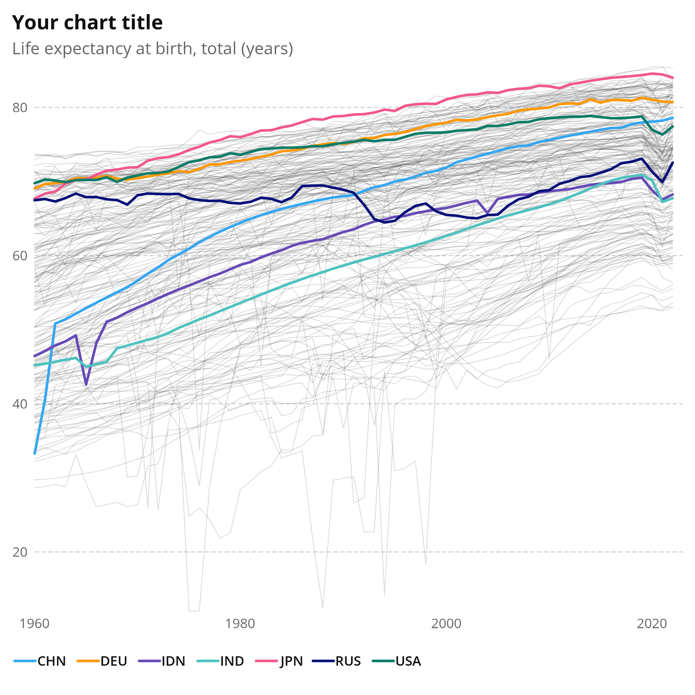
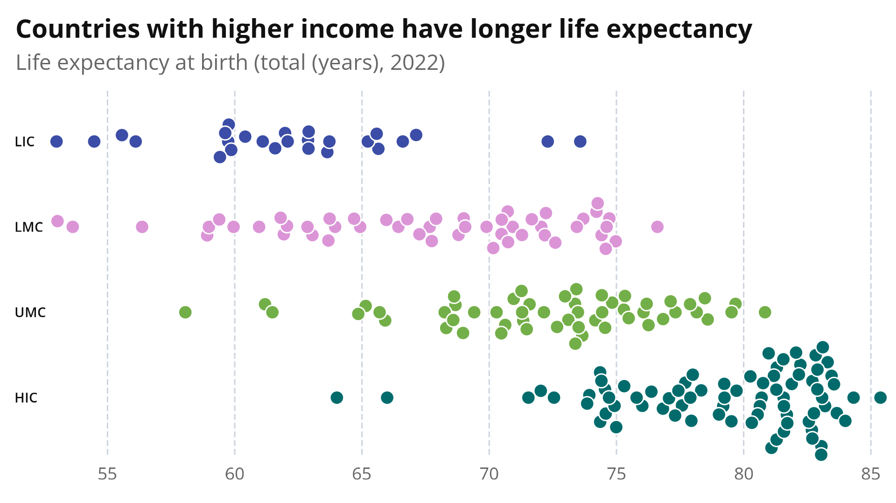

# wbplot

The World Bank ggplot2 theme.

## Installation

Install the package with `devtools::install_github("worldbank/wbplot")` or `remotes::install_github("worldbank/wbplot")`.

You might run into an authentication error. To overcome this, generate a token on [github.com/settings/personal-access-tokens](https://github.com/settings/personal-access-tokens) and run 

```r
devtools::install_github("worldbank/wbplot", auth_token = "MyPersonalToken")
```

## Using the package

When the package is installed, load it into your R session with `library(wbplot)`. The following functions and variables will become available.

### theme_wb()

`theme_wb()` is the main ggplot theme, which you should add to a ggplot object:

```
ggplot(data, aes(...)) +
  theme_wb() +
  geom_xyz()
```

The theme has some specific styling for certain chart types.

With `chartType = "line"`, the vertical grid lines, the X axis title and the Y axis title are removed. If you do need the Y axis title, you can add it with `addYAxisTitle = TRUE`.

For line charts, the x aesthetic should be mapped to a date variable, and the y aesthetic to a numerical variable.

```
lifexp <- dplyr::filter(life.expectancy, iso3c %in% c("USA", "CHN", "IND", "DEU", "RUS", "IDN", "JPN"))

ggplot(lifexp, aes(x = date, y = SP.DYN.LE00.IN, color = iso3c)) +
  theme_wb(chartType = "line") +
  geom_line(data = life.expectancy, linejoin = "round", lineend = "round", color = WBCOLORS$darkest, alpha = 0.15, linewidth = 0.25, ggplot2::aes(group = iso3c)) +
  geom_line(linejoin = "round", lineend = "round") +
  ylab("Life expectancy at birth, total (years)") +
  ggtitle("Your chart title", subtitle = "This is the subtitle") +
  theme(legend.title = element_blank())
```



With `chartType = "bar"`, both vertical and horizontal grid lines are removed, the X axis is moved to the top, and the bar labels are capitalized and bolded. The X axis title is removed, but can be added with `addXAxisTitle = TRUE`.

For bar charts, the x aesthetic should be mapped to a numerical variable, and the y aesthetic to a discrete variable.

The World Bank data visualization style calls for value labels next to the bars, which you can add with ggplot2's `geom_text()` (the default font size, font family, color and alignment (hjust) of `geom_text()` are modified by the theme). If some of the labels are cut off, you can add more space on the right of the chart with `xExpansion`.

```
country.latitudes <- head(dplyr::arrange(countries.edited, desc(latitude)),10)

ggplot(country.latitudes, aes(x = latitude, y = reorder(country, latitude))) +
  theme_wb(chartType = "bar", xExpansion = 3, addXAxisTitle = TRUE) +
  geom_bar(stat="identity", width = 0.66) +
  geom_text(aes(label = round(latitude, 1)), nudge_x = 0.7) +
  ggtitle("Your chart title", subtitle = "This is the subtitle") +
  xlab("Latitude (degrees North)")
```


With `chartType = "beeswarm"`, the horizontal grid lines are removed, the Y axis labels are capitalized and bolded, and the X axis title is removed. Like for bar charts you can add the X axis title with `addXAxisTitle = TRUE`, and expand the X axis with `xExpansion`.

To generate beeswarm plots with ggplot2, you can install the `ggbeeswarm` package, which offers the `geom_beeswarm()` geometry.

For beeswarm charts, the x aesthetic should be mapped to a numerical variable, and the y aesthetic to a discrete variable.

```
lifeexp.22 <- filter(life.expectancy, date == 2022) %>%
  left_join(countries, by = "iso3c")

ggplot(lifeexp.22, aes(x = SP.DYN.LE00.IN, y = income_level_iso3c, fill = tolower(income_level_iso3c))) +
  ggbeeswarm::geom_beeswarm(
    cex = 2.5,
    method = "swarm",
    priority = "random",
    size = 3
  ) +
  ggtitle("This is the beeswarm title", subtitle = "Life expectancy by income group") +
  theme_wb(chartType = "beeswarm") +
  scale_fill_wb_d(palette = "income") +
  theme(legend.position = "none")
```



Here is an example of single beeswarm, created with a dummy y aesthetic:

```
ggplot(lifeexp.22, aes(x = SP.DYN.LE00.IN, y = "dummy", fill = tolower(income_level_iso3c))) +
  ggbeeswarm::geom_beeswarm(
    cex = 4,
    method = "compactswarm",
    priority = "random",
    size = 3
  ) +
  ggtitle("This is the beeswarm title", subtitle = "Life expectancy by income group") +
  theme_wb(chartType = "beeswarm") +
  scale_fill_wb_d(palette = "income") +
  theme(
    legend.title = element_blank(),
    axis.text.y = element_blank()
  )
```


With `chartType = "scatter"`, the plot is only styled, but no chart elements are removed (so `theme_wb()` has the same effect as `theme_wb(chartType = "scatter")`.

The default shape for `geom_point()` is modified by the theme to a filled circle with a white outline.

For scatter plots, both the x and the y aesthetic should be mapped to a numerical variable.

```
ggplot(countries, aes(longitude, latitude, fill = tolower(income_level_iso3c))) +
  theme_wb(chartType = "scatter") +
  geom_point() +
  labs(
    title = "Scatterplot between x and y",
    subtitle = "This is the subtitle") +
  ylab("Latitude") +
  xlab("Longitude") +
  scale_fill_wb_d(palette = "income") +
  theme(legend.title = element_blank())
```


For all continuous axes (X axis for `bar`, `beeswarm` and `scatter`, Y axis for `line` and `scatter`), you can add a line indicating the zero value with `addXZeroLine = TRUE` or `addYZeroLine == TRUE`. When zero is not included on the axis initially, the axis will extend up until the zero value when a zero value line is added.

### Colors

#### All colors

All World Bank Data Visualization colors are available through the `WBCOLORS` global variable. Access the colors with `WBCOLORS[['colorName']]` or `WBCOLORS$colorName`. See `WBCOLORS` for all available colors.

#### Color scales

wbplot comes with 6 color scale functions:

- `scale_color_wb_c`and `scale_fill_wb_c`, for mapping continuous variables to the fill and color aesthetics. The `palette` parameter determines the color palette to use, and should be one of 'seq', 'seqRev', 'seqB', 'seqY', 'seqP' (these are the sequential color palettes), or 'divPosNeg' or 'divLR' (these are the diverging color palettes). The direction of the palette can be reversed by setting `direction = -1`. NA values will be colored in with `WBCOLORS$noData`.
- `scale_color_binned_wb`and `scale_fill_binned_wb` are the binned equivalents of `scale_color_wb_c`and `scale_fill_wb_c`. They share the same palettes, the number of bins can be set with `n.breaks`.
- `scale_color_wb_d`and `scale_fill_wb_d`, for mapping discrete variables to the fill and color aesthetics. When the `palette` parameter matches the mapped level variable, the levels will be automatically matched to their corresponding colors. The available palettes and their levels are
    - `default`: the default palette, with 9 distinct colors
    - `defaultText`: darker colors for the `default` palette, to be used for text
    - `region`: colors for regions. Matches the levels "wld", "nac", "lcn", "sas", "mea", "ecs", "eas", "ssf", "afe" and "afw"
    - `regionText`: darker colors for the `regions` palette, to be used for text. Matches the levels "nacText", "ssfText", "afeText", "meaText", "sasText", "easText", "wldText", "lcnText", "ecsText" and"afwText"
    - `income`: colors for income classes. Matches the levels "hic", "umic", "lmic" and"lic".
    - `gender`: colors for gender. Matches the levels "male", "female" and "diverse"
    - `urbanisation`: colors for urbanisation. Matches the levels "urban" and "rural".
    - `age`: colors for age classes. Matches the levels "youngestAge", "youngerAge", "middleAge", "olderAge" and "oldestAge"
    - `binary`: colors for binary variables. Matches the levels "yes" and "no"

```    
ggplot(data, aes(..., fill = region_iso3c)) +
  geom_xyz() +
  theme_wb() +
  color_fill_wb_c(palette = "region")
```

### add_note_wb()

To add a note or source reference at the bottom of your plot, add the `add_note_wb()` to your ggplot. Use the `noteTitle` for the title of the note (which will be displayed in bold), and the `note` parameter for the body of the note.

```
ggplot(data, aes(...)) +
  geom_xyz() +
  theme_wb() +
  add_note_wb(noteTitle = "Source:", note = "World Bank")
```

### Data

The package comes with 2 data sets:

- `countries`: available countries and regions from the World Bank API, as returned by `wbstats::wbcountries`
- `life.expectancy`: time series data for the SP.DYN.LE00.IN indicator for all countries and regions, as returned by `wbstats::wb_data("SP.DYN.LE00.IN")`

## Saving plots

You can save plots with `ggsave()`. You should be able to get good results by setting `units` to "px", `width` to 960, and `scale` to 2. The optimal `height` is determined by the chart type and the data, but the default is 540.

```
ggsave(filename = "my-worldbank-chart.png", units = "px", width = 960, height = 540, scale = 2)
```

For convenience, you can use `ggsave_wb(filename = "my-worldbank-chart.png")`, which has these values for units, dimensions and scale by default.

